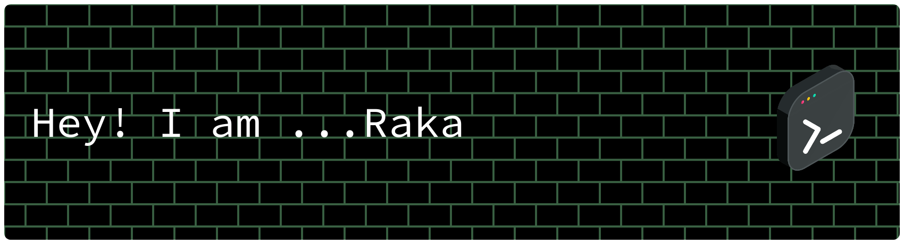
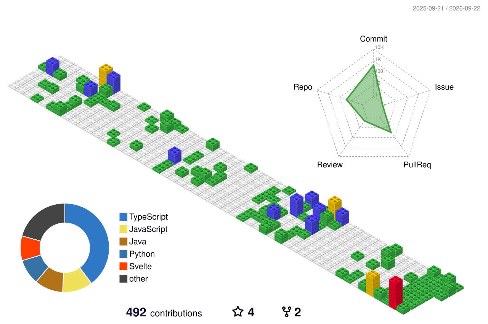

<!-- ======================================================== -->
<!-- 🚀 HEADER SECTION & GREETING -->
<!-- ======================================================== -->
<div align="center">
  
  
  <br/>

  <a href="https://git.io/typing-svg">
    
  </a>

  <p align="center">
    <a href="https://linkedin.com/in/Raka-Restu-Saputra" target="_blank">
      
    </a>
    <a href="https://instagram.com/rakresptra" target="_blank">
      
    </a>
    <a href="https://github.com/Raka-coder" target="_blank">
      
    </a>
  </p>
</div>

<br/>

<!-- ======================================================== -->
<!-- 📌 ABOUT ME & PASSION -->
<!-- ======================================================== -->
###  `About Me`

```yaml
identity:
  name: Raka Restu Saputra
  role: Computer Engineering Student & Developer
  passions: [IoT, Embedded Systems, Web Development, Computer Networking]
current_focus:
  learning: [Embedded Hardware Architecture, Cloud Integrations, Fullstack Ecosystems]
  building: [Smart IoT nodes, interactive web applications, real-time dashboards]
fun_fact: "Always fascinated by how software instructions turn into physical hardware actions! ⚡"
```

<br/>

<!-- ======================================================== -->
<!-- 🎨 GITASCII SHOWCASE WIDGET -->
<!-- ======================================================== -->
<div align="center">
  <a href="https://gitascii.com">
    
  </a>
</div>

<br/>

<!-- ======================================================== -->
<!-- 📊 GITHUB ACTIVITY STATS -->
<!-- ======================================================== -->
### 📊 `Activity Stats`

<div align="center">
  <a href="https://github.com/brunobritodev/awesome-github-stats">
    
  </a>
</div>

<br/>

<!-- ======================================================== -->
<!-- 🧊 3D CONTRIBUTION GRAPH -->
<!-- ======================================================== -->
### 🧊 `3D Contribution Landscape`

<div align="center">
  
</div>

<br/>

<!-- ======================================================== -->
<!-- 🐍 CONTRIBUTION SNAKE (MAIN BRANCH - WHITE THEME) -->
<!-- ======================================================== -->
### 🐍 `Contribution Snake (Main Branch)`

<div align="center">
  <a href="https://github.com/Raka-coder/Raka-coder/tree/main">
    
  </a>
</div>

<br/>

<!-- ======================================================== -->
<!-- 📬 FOOTER -->
<!-- ======================================================== -->
<div align="center">
    
</div>