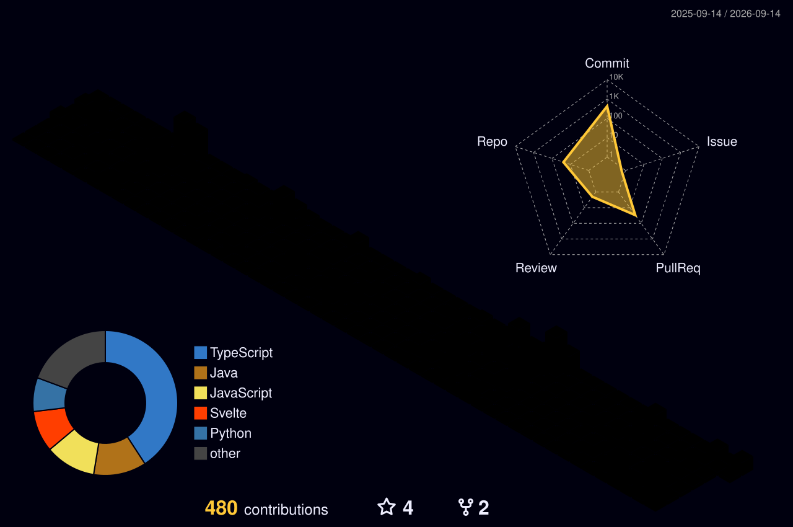

  
  <h2>Hi, I'm Raka Restu Saputra! 👋</h2>
  

  
  

---

### 👨‍💻 About Me

- 🎓 **Major**: Computer Engineering Student
- 🔭 **Focus Areas**: **Web Development**, **Internet of Things (IoT)**, and **Computer Networking**
- 🌱 **Currently Learning**: Embedded systems integration, cloud services, and scalable web apps
- 💡 **Passion**: Bridging software applications with physical IoT devices and reliable network systems

---

### 🛠️ Tech Stack & Tools

<table>
  <tr>
    <td align="center" width="25%"><strong>Languages</strong></td>
    <td>
      
      
      
      
      
      
    </td>
  </tr>
  <tr>
    <td align="center" width="25%"><strong>Web Development</strong></td>
    <td>
      
      
      
    </td>
  </tr>
  <tr>
    <td align="center" width="25%"><strong>IoT & Embedded</strong></td>
    <td>
      
      
      
      
    </td>
  </tr>
  <tr>
    <td align="center" width="25%"><strong>Networking & Tools</strong></td>
    <td>
      
      
      
      
    </td>
  </tr>
</table>

---

### 📊 GitHub Profile Summary

  
  
  
  
  

---

### 🧊 3D Contribution Graph

  

---

### 🐍 Contribution Snake

  

---

  

